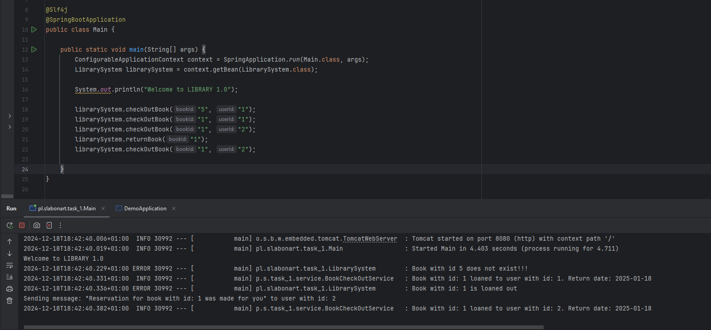

# Task 1

Sample usage:

1. Checkout not existing book
2. Successful checkout
3. Try to checkout loaned book
   - info "book loaned"
   - making a reservation
   - sending the notification to user
4. Returning the book
5. Successful checkout

# Task 2
**_Refactor the Employee class to eliminate switch expressions in the calculatePay and calculateBonus methods, following the Open-Closed Principle._**

Adding the EmployeeFactory class which creates appropriate Employee type based on it's type.
Types are configured in the "employee-config.json" file.
This way we can add new Employee subtype easily by adding a new class and updating the config file.

# Task 3
 _**Evaluate a Java codebase for a payment processing system to ensure it adheres to the Liskov Substitution Principle (LSP) and refactor as necessary.**_

In the source code the PayPalPayment class violates LSP by throwing the UnsupportedOperationException.

Although we should refactor subclass implementations without altering the existing API I decided to add new "PaymentProcessingException" to the API to clarify the reason of processing failure.

Added new type of payment "NewAdvancedPayment" and tests for PaymentProcessor including different payment types and exceptions.

# Task 4

Introduced Intentional Issues:
1. Bugs
    - _**Connection Closed Too Early - SampleController line 18.**_
      The database connection is closed before the query executes, which will cause a runtime error.
    - _**Statement Used After Connection Closed - SampleController line 19**_
      Attempting to use a Statement object after the associated Connection has been closed.
    - **_Division by Zero - SampleController line 30_**
2. Vulnerabilities
    - **_SQL Injection - SampleController line 19._**
      Directly concatenating user input in SQL queries makes the code vulnerable to SQL injection.
    - **_Insecure Deserialization - SampleController line 42._**
      Deserializing untrusted data can lead to remote code execution or other attacks.
    - **_Hardcoded Password SampleController line 50.**_ 
    Using a hardcoded password exposes sensitive credentials in the source code.
3. Code Smells:
   - **_Returning null - SampleController line 25._**
    Returning null instead of a proper error response makes the API less user-friendly and harder to debug.
   - **_Exposing Sensitive Data  - SampleController line 51._**
     eturning the plaintext password as a response is a serious design flaw and a security issue.
   - **_Overcomplicated Logic - SampleController line 58._**
   Unnecessarily complex logic with the continue statement in the loop reduces code readability and maintainability.

